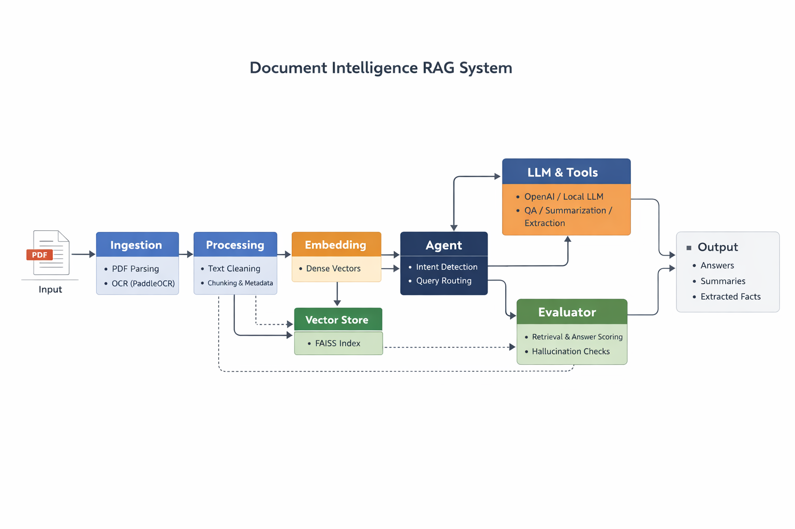

# 📄 Hybrid Retrieval RAG System with Evaluation and Reranking

A modular, evaluation-driven Retrieval-Augmented Generation (RAG) system for document understanding:

* Question Answering (QA)
* Summarization
* Key Information Extraction

This system goes beyond basic RAG by combining **hybrid retrieval, reranking, and evaluation-driven iteration** to identify and address real-world failure modes.

---

# 🚀 Key Highlights

* 🔎 Hybrid retrieval (Dense + BM25) with strong recall
* 🔁 Cross-encoder reranking for high-precision retrieval
* 🎯 Metadata-aware scoring (section-based weighting)
* 🤖 Agent-based query routing (intent + query-type aware)
* 🧠 Multi-backend LLM support (OpenAI / HuggingFace / llama.cpp)
* 📊 Evaluation-driven development (retrieval, answer quality, hallucination)
* 🧪 CLI-based testing and benchmarking

---

# 📊 Current Performance (Evaluation)

| Metric          | Score |
| --------------- | ----- |
| Retrieval Score | ~0.77 |
| Answer Score    | ~0.71 |
| Easy            | 0.76  |
| Medium          | 0.85  |
| Hard            | 0.68  |
| Tricky          | 0.52  |

---

## 🧠 Key Insight

> Retrieval is no longer the bottleneck — reasoning and generation control are.

* Retrieval quality is strong and reliable
* Remaining failures occur in:

  * negation handling ("NOT" queries)
  * precise fact answering
  * multi-step reasoning

---

# 🏗️ Architecture

## High-Level Flow

PDF
→ Ingestion (PyMuPDF + OCR fallback)
→ Processing (cleaning + chunking + metadata)
→ Embeddings (SentenceTransformers)
→ Vector Store (FAISS)
→ Hybrid Retrieval (Dense + BM25)
→ Reranking (Cross-Encoder)
→ Context Construction
→ Agent (intent + query-type routing)
→ Tools (QA / Summarization / Extraction)
→ LLM (OpenAI / Local / llama.cpp)
→ Output

---

# 🧠 System Design

## Retrieval Layer

* Dense embeddings (MiniLM)
* Sparse BM25 retrieval
* Score merging
* Metadata weighting

## Ranking Layer

* Cross-encoder reranker (MiniLM)
* Improves top-k relevance

## Generation Layer

* Prompt-controlled generation
* Strict grounding (context-only answers)
* Task-specific prompting (QA / summary / extraction)

## Evaluation Layer

* Keyword-based scoring (with fuzzy matching)
* Answer depth scoring
* Hallucination detection
* Difficulty-based benchmarking

---

# 📂 Project Structure

agents/ → Agent orchestration and tools
rag/ → Retrieval, embeddings, reranking, chunking
llm/ → LLM abstraction layer
ingestion/ → PDF loading + OCR
eval/ → Evaluation dataset + evaluator
utils/ → Logging
test/ → CLI pipeline and evaluation

---

# ⚙️ Installation

```bash
pip install -r requirements.txt
```

---

# ▶️ Usage

### Run a single query

```bash
python -m test.test_rag --pdf data/sample.pdf --query "What is this paper about?"
```

### Run evaluation

```bash
python -m test.test_eval --pdf data/sample.pdf --backend llama_cpp
```

---

# 🧠 Supported LLMs

* OpenAI (GPT models)
* Local HuggingFace (Flan-T5)
* llama.cpp (GGUF models like Mistral-7B)

---

# ⚠️ Current Limitations

* Weak handling of negation and “NOT” queries
* No multi-step reasoning (single-pass generation)
* Flat context (no hierarchical structure)
* Keyword-based evaluation (not fully semantic)
* No strict citation validation

---

# 🔮 Roadmap

## Next Immediate Focus

* Two-step generation (evidence → answer)
* Negation-aware reasoning
* Structured context (section-aware hierarchy)

## Future

* LLM-based evaluation (faithfulness, semantic grading)
* Semantic chunking (heading-aware)
* LLM-based agent routing
* Production optimizations (caching, streaming)

---

# 🧠 Final Takeaway

> This project demonstrates that improving retrieval alone is insufficient —
> real-world RAG systems require **controlled reasoning and evaluation-driven design**.

---

# 📜 License

MIT License
